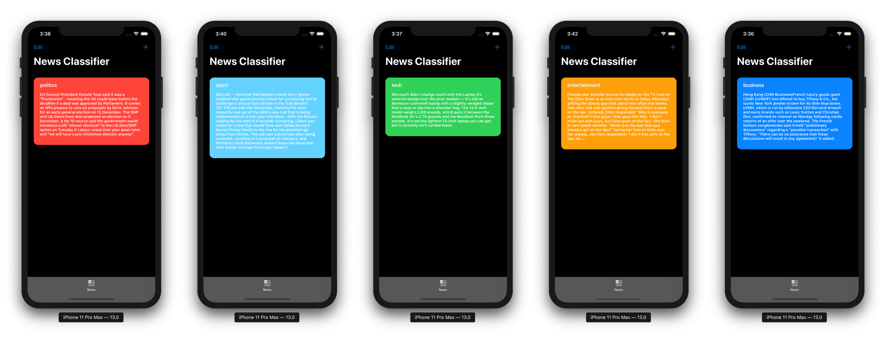

# Easy Topic Classifier on iOS with Apple's Natural Language Framework
> How to take advantage of Apple's APIs with already-existing data for text classification

## Full Tutorial
**Overview:**

1. What is Apple's "Natural Language" library?
2. Find the dataset and preprocess it
3. Train the model
4. Evaluate the model
5. Build the iOS Application
6. Conclusion

I've wrote a full medium tutorial:

**[Medium Article](https://heartbeat.fritz.ai/easy-topic-classifier-on-ios-with-apples-natural-language-framework-f9825143ecdb)**

<!--### Full article 
**[Medium Article](https://heartbeat.fritz.ai/using-core-ml-and-natural-language-for-sentiment-analysis-on-ios-d9469ce6c0ef)**-->

## Final Result:

**Here’s the final result:**

## About me

### Omar MHAIMDAT:

**Linkedin:** [Linkedin profile](https://www.linkedin.com/in/omarmhaimdat/)

**Email:** omarmhaimdat@gmail.com

Distributed under the MIT license. See ``LICENSE`` for more information.

## Other projects

### Face detection and recognition with CoreML and ARKit

* [Github Repo](https://github.com/omarmhaimdat/WhoAreYou)

* [Medium article with full tutorial](https://medium.com/@omarmhaimdat/face-detection-and-recognition-with-coreml-and-arkit-8b676b7448be?source=friends_link&sk=c34c61b820f749862eca97cc63dc518c)

### Creating a License Plate Reading iOS Application Using OCR Technologies and CoreData

* [Github Repo](https://github.com/omarmhaimdat/WhereAreYouFrom)

* [Medium article with full tutorial](https://medium.com/@omarmhaimdat/licence-plate-reader-ios-application-using-ocr-technologies-and-coredata-3cdee933c38b)

### Using Core ML and Natural Language for Sentiment Analysis on iOS

* [Github Repo](https://github.com/omarmhaimdat/SentimentAnalysisApp)

* [Medium article with full tutorial](https://heartbeat.fritz.ai/using-core-ml-and-natural-language-for-sentiment-analysis-on-ios-d9469ce6c0ef)

### Building a Sound Classification iOS Application using AI

* [Github Repo](https://github.com/omarmhaimdat/SoundClassifier)

* [Medium article with full tutorial](https://heartbeat.fritz.ai/building-a-sound-classification-ios-application-using-ai-1655506d1763)